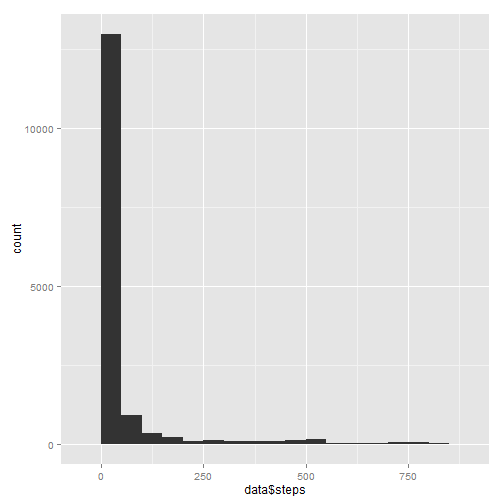
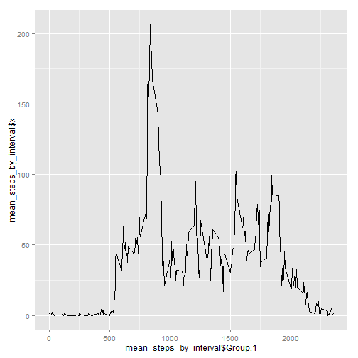
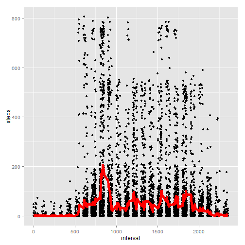
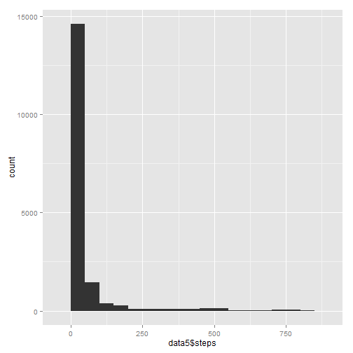
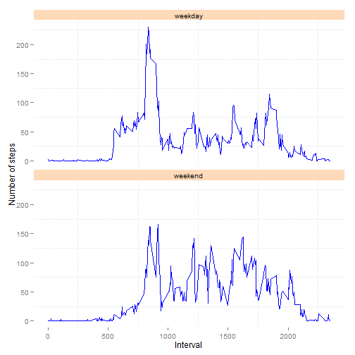

# Reproducible Research: Peer Assessment 1
January 2015, Andreas von Ballmoos

This is an R markdown document to solve the given assignment.

## Prerequisites
First I make sure that the knitr and ggplot2 packages are installed and loaded. I take the opportunity to get used to plot with ggplot2.


```r
if (!require("knitr")) {
install.packages("knitr")
}
require("knitr") 

if (!require("ggplot2")) {
install.packages("ggplot2")
}
```

```
## Loading required package: ggplot2
```

```r
require("ggplot2") 
```

## Loading and preprocessing the data
Before loading the data, I unzip the source file. I then read it in and convert the data column to date format.

```r
unzip("activity.zip")
data <- read.csv("activity.csv", na.strings="NA")
data$date=as.Date(data$date)
```


## What is mean total number of steps taken per day?
### Make a histogram of the total number of steps taken each day

```r
qplot(data$steps, binwidth=50)
```

 

### Calculate and report the mean and median total number of steps taken per day
Before the calculating, get rid of the NAs

```r
good <- !is.na(data$steps)
data2 <- data[good,]

total_steps_by_day <- aggregate(data2$steps, list(data2$date), sum)
mean(total_steps_by_day$x)
```

```
## [1] 10766.19
```

```r
median(total_steps_by_day$x)
```

```
## [1] 10765
```

## What is the average daily activity pattern?
### Make a time series plot of the 5-minute interval and the average number of steps taken, averaged across all days

```r
good <- !is.na(data$steps)
data2 <- data[good,]

mean_steps_by_interval <- aggregate(data2$steps, list(data2$interval), mean)
g <- ggplot(mean_steps_by_interval, aes(x=mean_steps_by_interval$Group.1, y=mean_steps_by_interval$x))
g + geom_line()
```

 

### Which 5-minute interval, on average across all the days in the dataset, contains the maximum number of steps?
Looking at the plot above, the interval must be around 800

```r
y <- mean_steps_by_interval[order(mean_steps_by_interval$x, na.last=T, decreasing =T),]
head(y,1)
```

```
##     Group.1        x
## 104     835 206.1698
```
It's the interval with the id 835

## Imputing missing values
### Calculate and report the total number of missing values in the dataset
There are 2304 NA's based on the summary() function. Note that there are always entire days that are missing while all others are complete. 

```r
summary(data)
```

```
##      steps             date               interval     
##  Min.   :  0.00   Min.   :2012-10-01   Min.   :   0.0  
##  1st Qu.:  0.00   1st Qu.:2012-10-16   1st Qu.: 588.8  
##  Median :  0.00   Median :2012-10-31   Median :1177.5  
##  Mean   : 37.38   Mean   :2012-10-31   Mean   :1177.5  
##  3rd Qu.: 12.00   3rd Qu.:2012-11-15   3rd Qu.:1766.2  
##  Max.   :806.00   Max.   :2012-11-30   Max.   :2355.0  
##  NA's   :2304
```

```r
summary(good)
```

```
##    Mode   FALSE    TRUE    NA's 
## logical    2304   15264       0
```
### Devise a strategy for filling in all of the missing values in the dataset
In this dataset the NA's are always whole days. Linear interpolatation of the NA's is therefore not possible.

I think **the mean of the interval over all available days - rounded to an integer** is a good value to replace the NAs with. The values of a given interval are more stable over the days than the values within a day.

Alternatives might be
* set NA's to 0: but this would lower all averages below the true level
* set NA's to "total steps per day diveded by 288"" (evenly distributed over the whole day): but this is an unplausible assumption, because the activity varies heavily within the day.
 

```r
qplot(interval, steps, data=data2) + stat_summary(fun.y=mean, colour="red", geom="line", size=2)
```

 

### Create a new dataset that is equal to the original dataset but with the missing data filled in
First merge the dataset with the mean of the steps by interval - which serves as default value for an interval - and sort it back.

```r
data3 <- merge(data, mean_steps_by_interval, by.x="interval", by.y="Group.1")
data4 <- data3[with(data3, order(date, interval)), ]
```
Now loop through the dataset and replace NAs with the default values

```r
for (i in 1:nrow(data4) ) {
    if (is.na(data4[i,2])) data4[i,2] <- data4[i,4]
}
head(data4)
```

```
##     interval     steps       date         x
## 1          0 1.7169811 2012-10-01 1.7169811
## 63         5 0.3396226 2012-10-01 0.3396226
## 128       10 0.1320755 2012-10-01 0.1320755
## 205       15 0.1509434 2012-10-01 0.1509434
## 264       20 0.0754717 2012-10-01 0.0754717
## 327       25 2.0943396 2012-10-01 2.0943396
```
And remove the column with the default values and put the columns in the original order again:

```r
steps <- as.integer(round(data4[,2], digits=0))
date <- data4[,3]
interval <- data4[,1]
data5 <- data.frame(steps, date, interval)
head(data5)
```

```
##   steps       date interval
## 1     2 2012-10-01        0
## 2     0 2012-10-01        5
## 3     0 2012-10-01       10
## 4     0 2012-10-01       15
## 5     0 2012-10-01       20
## 6     2 2012-10-01       25
```
### Make a histogram of the total number of steps taken each day

```r
qplot(data5$steps, binwidth=50)
```

 

### Calculate and report the mean and median total number of steps taken per day

```r
total_steps_by_day <- aggregate(data5$steps, list(data5$date), sum)
mean(total_steps_by_day$x)
```

```
## [1] 10765.64
```

```r
median(total_steps_by_day$x)
```

```
## [1] 10762
```
The numbers differ a little bit from the ones that were calculated without the NA's. But the difference is very small (< 0.1%).

### What is the impact of imputing missing data on the estimates of the total daily number of steps?
There is always an impact of imputing missing data. In my example the mean and median are a little bit lower.

The choice of a good imputing strategy is an important step and needs thorough consideration. The more domain expertise there is, the better! The strategy must look at effects like usual behaviour of the subject/customers, weather conditions, typical patterns of activity or bank holidays.

## Are there differences in activity patterns between weekdays and weekends?
To answer this questions we need to add grouping information to the dataset that indicates whether a day is a weekday or a weekend day.

### Create a new factor variable in the dataset with two levels
I need to switch my system setting to English to get the English abbreviated day labels.

```r
Sys.setlocale("LC_TIME", "English")
```

```
## [1] "English_United States.1252"
```

```r
data5$dayofweek <- weekdays(data5$date, abbreviate=T)
head(data5)
```

```
##   steps       date interval dayofweek
## 1     2 2012-10-01        0       Mon
## 2     0 2012-10-01        5       Mon
## 3     0 2012-10-01       10       Mon
## 4     0 2012-10-01       15       Mon
## 5     0 2012-10-01       20       Mon
## 6     2 2012-10-01       25       Mon
```
And loop again through the dataset to determine weekend days and finally factorize the column:

```r
data5$weekdaycategory <- "weekday"
for (i in 1:nrow(data5) ) {
    if (data5[i,4]=='Sat') data5[i,5] <- 'weekend'
    if (data5[i,4]=='Sun') data5[i,5] <- 'weekend'
}
data5$weekdaycategory <- factor(data5$weekdaycategory)
str(data5)
```

```
## 'data.frame':	17568 obs. of  5 variables:
##  $ steps          : int  2 0 0 0 0 2 1 1 0 1 ...
##  $ date           : Date, format: "2012-10-01" "2012-10-01" ...
##  $ interval       : int  0 5 10 15 20 25 30 35 40 45 ...
##  $ dayofweek      : chr  "Mon" "Mon" "Mon" "Mon" ...
##  $ weekdaycategory: Factor w/ 2 levels "weekday","weekend": 1 1 1 1 1 1 1 1 1 1 ...
```

### Make a panel plot containing a time series plot
Split the graph into weekdays/weekends with the average steps taken per interval:

```r
g <- ggplot(data5, mapping=aes(x=interval, y=steps))
g + facet_wrap(~weekdaycategory, ncol=1) + layer(geom = "line", col="blue", stat = "summary", fun.y = "mean") + theme(strip.background = element_rect(fill="peachpuff")) + theme(panel.background = element_rect(fill = "white")) + labs(y="Number of steps", x="Interval") 
```

 

### Finalize
To finalize I delete the unzipped file to save time when uploading to github

```r
file.remove("activity.csv")
```

```
## [1] TRUE
```

Uff... This was an extremly hard piece of work! I am looking forward to looking at my peers' solutions.
